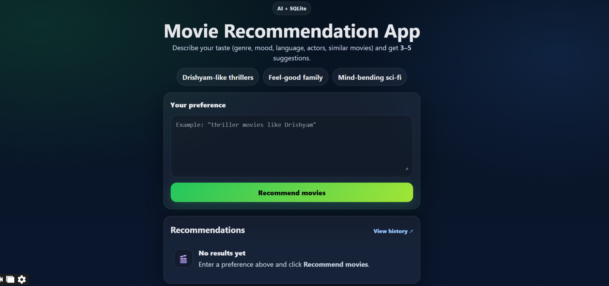
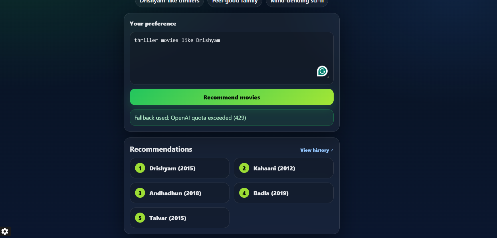

# 🎬 Movie Recommendation App

A simple full-stack web application that suggests movies based on user preferences such as genre, mood, or similar films.

This project was built to demonstrate practical skills in **frontend development, backend APIs, database integration, and error handling** in a real-world scenario.

---

## ✨ What this project does

* Takes user input such as:

  * Genre
  * Mood
  * Similar movies
  * Actors or language
* Returns **3–5 movie recommendations**
* Saves recommendations in a **SQLite database**
* Displays history of past recommendations
* Handles API errors gracefully using fallback recommendations

---

## 🛠️ Tech Stack

### Frontend

* React (Vite)
* CSS

### Backend

* Node.js
* Fastify

### Database

* SQLite

### Other Tools

* dotenv
* OpenAI API (with fallback handling)

---

## 📌 Features

* Clean and responsive UI
* Backend API with structured responses
* Database storage of user queries
* Error handling and fallback mechanism
* History endpoint to view past recommendations

---

## 🧠 Why I built this

I wanted to build a small but complete application that covers:

* API integration
* Full-stack communication
* Database storage
* Real-world error handling

This project helped me understand how frontend, backend, and database work together in a production-style setup.

---

## 🚀 How to Run the Project

### 1. Clone the repository

```bash
git clone <your-repo-link>
cd movie-recommendation-app
```

---

### 2. Backend Setup

```bash
cd backend
npm install
npm run dev
```

Backend runs at:

```
http://localhost:3001
```

---

### 3. Frontend Setup

Open a new terminal:

```bash
cd frontend
npm install
npm run dev
```

Frontend runs at:

```
http://localhost:5173
```

---

## 🗄️ Database

SQLite is used to store:

* User input
* Recommended movies
* Timestamp

You can check saved data here:

```
http://localhost:3001/history
```

---

## ⚠️ API Handling

If the OpenAI API quota or billing is unavailable:

* The system automatically returns fallback movie recommendations
* The app continues to work normally
* Data is still saved in the database

This ensures reliability and a better user experience.

---

## 📷 Screenshots




```

---

## 🔮 Future Improvements

Possible enhancements:

* Movie posters and ratings
* User login
* Cloud deployment
* Improved recommendation logic

---

## 👨‍💻 Author

Built by **Sanjeet Singh Solanki**
As part of a full-stack development assignment and learning project.

---

## 📬 Contact

Email:
[sanjeetsinghsolanki11@gmail.com]

---

## ⭐ Notes

Before running the project:

* Install dependencies using `npm install`
* Do not commit `.env` or `node_modules` to GitHub

---

## Small improvement I made (so you know)

* Fixed headings hierarchy
* Corrected screenshot formatting
* Made wording more natural
* Improved readability for recruiters

